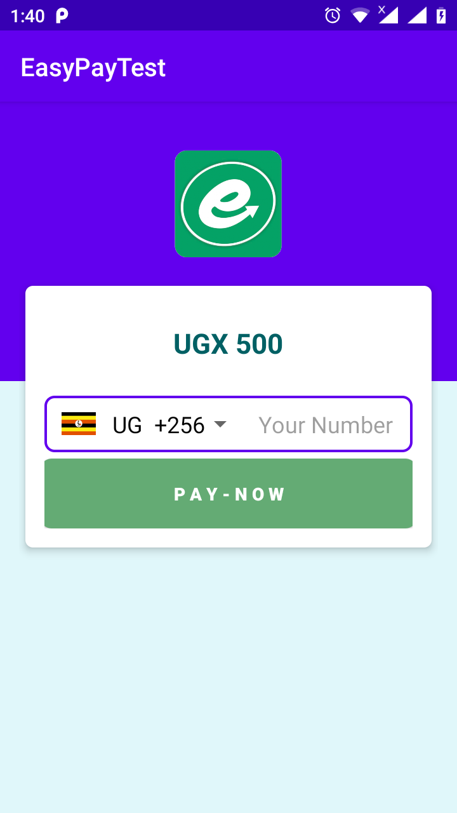

## Demo
[][2]

##Step 1. Add the JitPack repository to your build file

### Add it in your root build.gradle at the end of repositories:

	allprojects {
		repositories {
			...
			maven { url 'https://jitpack.io' }
		}
	}
### Step 2. Add the dependency

	dependencies {
	        implementation 'com.github.wagaana:EasyPay-API:0.02'
	}
	
### usage

#### Onclick listener call the code below

	new Request(MainActivity.this)
                                .setAmountToPay("500")
                                .setCurrency("UGX")
                                .setPaymentReason("some reason")
                                .setClientSecret("your secret")
                                .setClientID("your client id")
                                .initialize();
                            
### Add the function below to your code

	@Override
        public void onActivityResult(int requestCode, int resultCode, @Nullable Intent data) {
            super.onActivityResult(requestCode, resultCode, data);
            if (requestCode == EP_REQUEST_CODE && resultCode == RESULT_OK) {
                String stringResponse = data.getStringExtra("response");
                Toast.makeText(this, stringResponse, Toast.LENGTH_SHORT).show();
            }
        }

